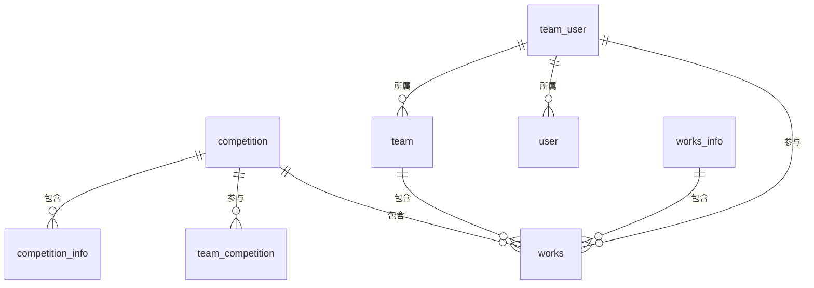

# 数据库 ER 图

## 实体关系图

# 数据库字段类型说明

## competition 表

- id (BIGINT(20)): ID，主键，自增
- name (VARCHAR(64)): 比赛名称，非空
- staff_id (BIGINT(20)): 主办方id，非空
- description (VARCHAR(100)): 比赛简介描述，可空
- header_imageURL (VARCHAR(500)): 头图，可空
- signup_start_date (DATETIME): 报名开始日期，可空
- signup_end_date (DATETIME): 报名结束日期，可空
- start_date (DATETIME): 比赛开始日期，可空
- end_date (DATETIME): 比赛结束日期，可空
- score_start_date (DATETIME): 评分开始日期，可空
- score_end_date (DATETIME): 评分结束日期，可空
- ctime (DATETIME): 创建时间，可空
- mtime (DATETIME): 修改时间，可空
- deleted (BOOLEAN DEFAULT FALSE): 是否删除，非空

## competition_info 表

- id (BIGINT(20)): ID，主键，自增
- competition_id (BIGINT(20)): 比赛ID，非空
- content (TEXT): 介绍页面富文本，非空
- ctime (DATETIME): 创建时间，可空
- mtime (DATETIME): 修改时间，可空
- deleted (BOOLEAN DEFAULT FALSE): 是否删除，非空

## team_competition 表

- id (BIGINT(20)): ID，主键，自增
- team_id (BIGINT(20)): 团队id，非空
- competition_id (BIGINT(20)): 比赛id，非空
- works_id (BIGINT(20)): 作品id，可空
- ctime (DATETIME): 创建时间，可空
- mtime (DATETIME): 修改时间，可空
- deleted (BOOLEAN DEFAULT FALSE): 是否删除，非空

## user 表

- id (BIGINT(20)): ID，主键，自增
- name (VARCHAR(64)): 用户名，可空
- avatar_image (VARCHAR(500)): 用户头像，可空
- email (VARCHAR(50)): 邮箱，可空
- password (VARCHAR(50)): 密码，非空
- description (VARCHAR(100)): 用户描述，可空
- is_staff (BOOLEAN DEFAULT FALSE): 是否为主办方，非空
- public_key (VARCHAR(4096)): 公钥，可空
- private_key (VARCHAR(4096)): 私钥，可空
- ctime (DATETIME): 创建时间，可空
- mtime (DATETIME): 修改时间，可空
- deleted (BOOLEAN DEFAULT FALSE): 是否删除，非空

## team_user 表

- id (BIGINT(20)): ID，主键，自增
- team_id (BIGINT(20)): 团队id，非空
- user_id (BIGINT(20)): 用户id，非空
- is_admin (BOOLEAN DEFAULT FALSE): 是否为管理员，非空
- is_join (BOOLEAN DEFAULT FALSE): 是否加入，非空
- ctime (DATETIME): 创建时间，可空
- mtime (DATETIME): 修改时间，可空
- deleted (BOOLEAN DEFAULT FALSE): 是否删除，非空

## team 表

- id (BIGINT(20)): ID，主键，自增
- name (VARCHAR(20)): 团队名称，非空
- ctime (DATETIME): 创建时间，可空
- mtime (DATETIME): 修改时间，可空
- deleted (BOOLEAN DEFAULT FALSE): 是否删除，非空

## works_info 表

- id (BIGINT(20)): ID，主键，自增
- team_id (BIGINT(20)): 团队id，非空
- image_url_list (TEXT): 轮播图url，非空
- works_id (BIGINT(20)): works_id，非空
- content (TEXT): 比赛介绍富文本，非空
- file_id (BIGINT(20)): 作品文件id，非空
- ctime (DATETIME): 创建时间，可空
- mtime (DATETIME): 修改时间，可空
- deleted (BOOLEAN DEFAULT FALSE): 是否删除，非空

## works 表

- id (BIGINT(20)): ID，主键，自增
- name (VARCHAR(64)): 作品名，非空
- team_id (BIGINT(20)): 团队id，非空
- header_imageURL (VARCHAR(500)): 头图，可空
- ctime (DATETIME): 创建时间，可空
- mtime (DATETIME): 修改时间，可空
- deleted (BOOLEAN DEFAULT FALSE): 是否删除，非空
